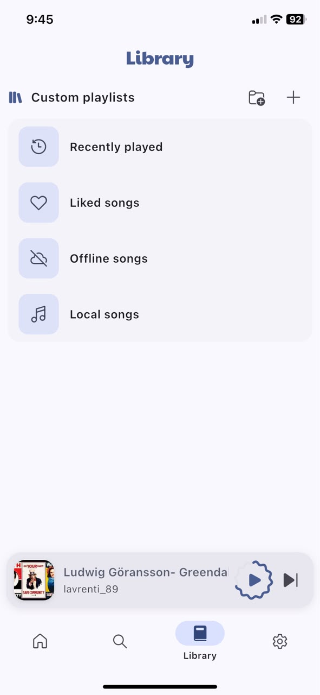
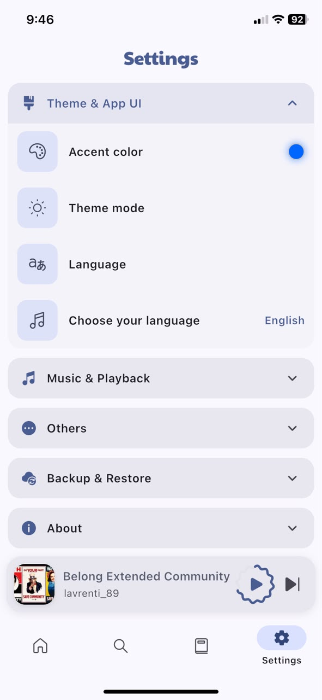
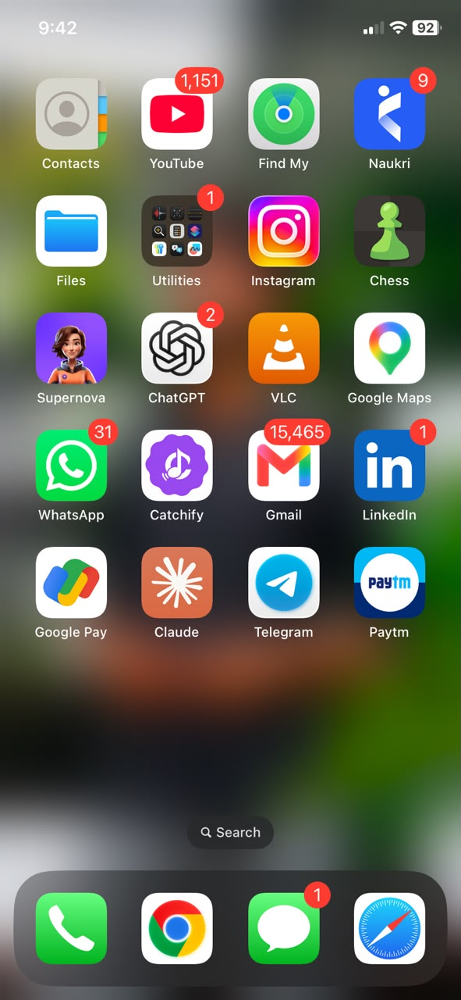

<div align="center">


# Catchify

Unlock the full potential of music: Stream effortlessly with one app!

[](https://github.com/thamodharangm/catchify/stargazers)
[](https://github.com/thamodharangm/catchify/fork)
[](https://github.com/thamodharangm/catchify/releases)
[](https://github.com/thamodharangm/catchify/releases)
[](LICENSE)

---

---

## Features

<center>

Online song search with suggestions <br/>
Offline listening support <br/>
Import & export your data and never lose it <br/>
Add custom playlists with link <br/>
Optimized sound experience <br/>
SponsorBlock support <br/>
Lyrics support <br/>
No ads <br/>
No subscriptions <br/>
Built-in updater <br/>
Built-in equalizer with presets <br/>
21 supported languages <br/>
Material UI & accent colors & dynamic colors (Android 12+) <br/>

</center>


---

## Screenshots

<div align="center">

| Home Feed | Now Playing Player | Synced Lyrics |
| :---: | :---: | :---: |
|  |  |  |

<br/>

| Instant Search | Music Library & Offline | Settings & Themes | iOS Installed |
| :---: | :---: | :---: | :---: |
|  |  |  |  |

</div>


---

## Download

<table>
  <tr>
    <td align="center">
      <a href="https://github.com/thamodharangm/catchify/releases/latest">
        <br/>
        <b>Android (.apk)</b>
      </a>
    </td>
    <td align="center">
      <a href="https://github.com/thamodharangm/catchify/releases/latest">
        <br/>
        <b>iOS (.ipa)</b>
      </a>
    </td>
    <td align="center">
      <a href="https://catchify.textmateai.online/">
        <br/>
        <b>Web & Guides</b>
      </a>
    </td>
  </tr>
</table>

- **Android Direct Download:** [Latest APK](https://github.com/thamodharangm/catchify/releases/latest)
- **iOS Sideloading (Sideloadly / AltStore / TrollStore):** [Latest IPA](https://github.com/thamodharangm/catchify/releases/latest)
- **Official Website:** [catchify.textmateai.online](https://catchify.textmateai.online/)


---

## Contributors

Special thanks to all contributors for their time and effort.

<a href="https://github.com/thamodharangm/catchify/graphs/contributors">
  
</a>


---

## Contribute

Contributions are always welcome. Please read our [contributing guidelines](https://github.com/thamodharangm/catchify/blob/main/CONTRIBUTING.md) before contributing.

---

## F.A.Q

You can see frequently asked questions and their answers [here](https://github.com/thamodharangm/catchify/discussions/728).

---

## Credits

[Catchify](https://github.com/gokadzev/Catchify) - Original inspiration for the concept and name. It is now completely reimplemented with new design and branding.


---

## License

```
Copyright © 2026 Thamodharan GM

Catchify is licensed under the Apache License, Version 2.0. You may use, modify, and
distribute this software freely under the terms of the Apache 2.0 License. You must
retain copyright notices and include a copy of the license in distributions.

Allowed: Commercial use, modification, distribution, and patent use.
```

See the [Apache License 2.0](https://github.com/thamodharangm/catchify/blob/main/LICENSE) for full details.

---

## Disclaimer

```
Thamodharan GM and its contributors do not host, own, or distribute any copyrighted audio content.
The app provides access to content through plugins and external sources. All trademarks, songs, audio files, and related content remain the property of their respective owners and are protected by applicable copyright laws.
Included plugins are provided for interoperability and educational purposes only. Users are solely responsible for ensuring that their use of the app complies with local laws, copyright regulations, and the terms of service of the respective content providers.
The developers of Catchify do not encourage or endorse copyright infringement and assume no liability for misuse of the software or third-party plugins.
```
---
